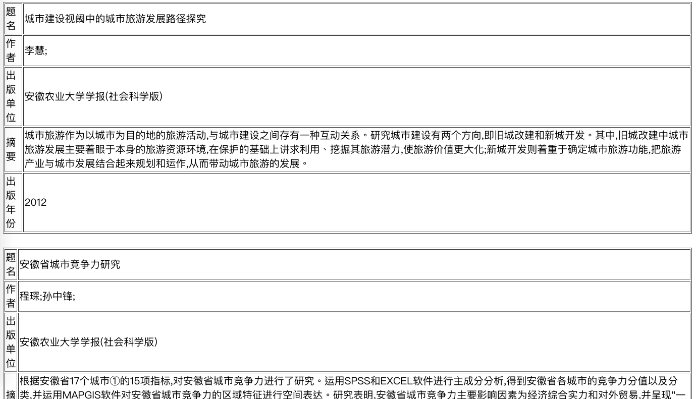

# Lab1 - Lucene

## Build

- To build the IR system, run the following command.

```bash
mvn package
```

- To build the indexer by yourself, change the \<mainClass\> attribute in `pom.xml` to `Qibin.LuceneIndex` and run the command above.

## Run

- First, put `CNKI_journal_v2.txt` in the root folder and use `indexer-jar-with-dependencies.jar` to generate the `index/` folder.

```bash
java -jar indexer-jar-with-dependencies.jar
```

- Second, run the system, type in the conditions and view the results in results.html

```bash
java -jar target/IR-1.0-SNAPSHOT-jar-with-dependencies.jar > results.html
<title>
<author>
<publish>
<date>
```

For example, type in the follows to search using the keyword **城市** in all documents by all authors in the year 2012.

```bash
java -jar target/IR-1.0-SNAPSHOT-jar-with-dependencies.jar > results.html
城市


2012
```

- The results are shown below.


